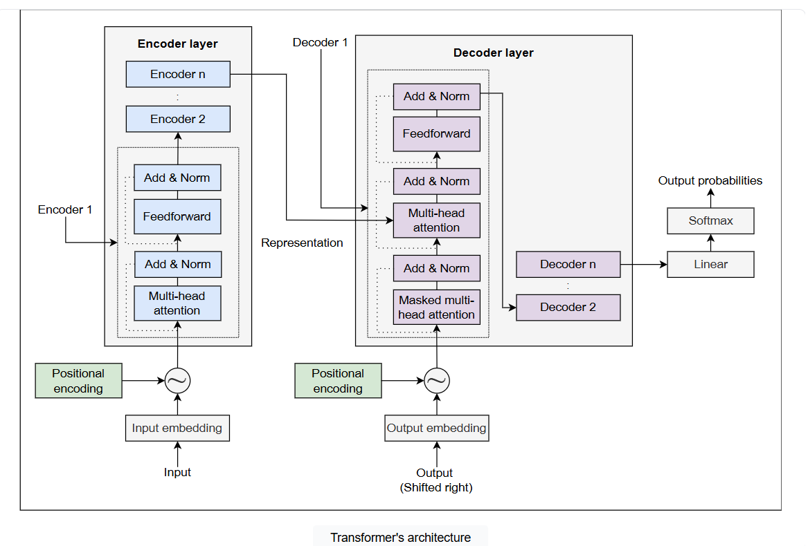
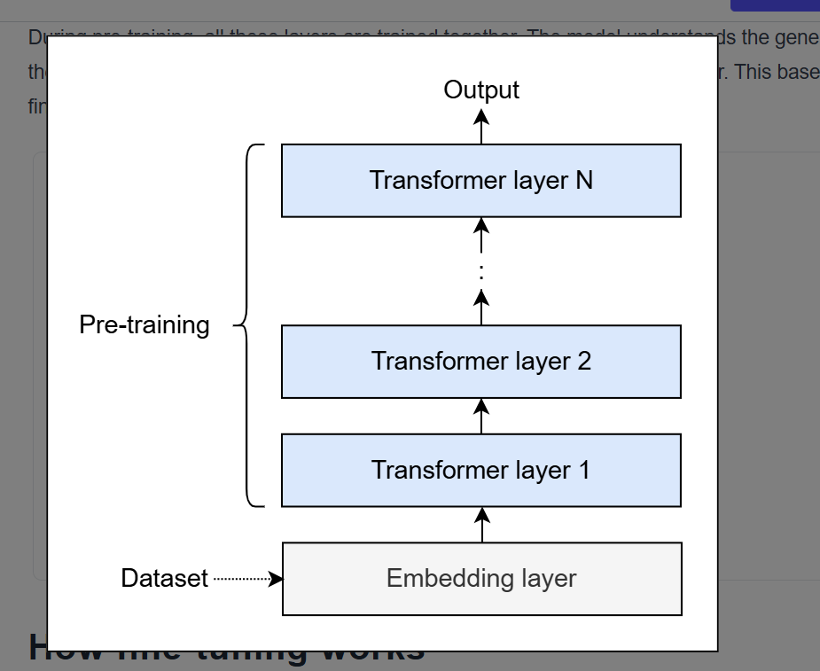
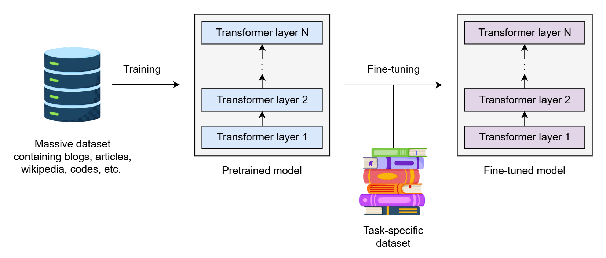
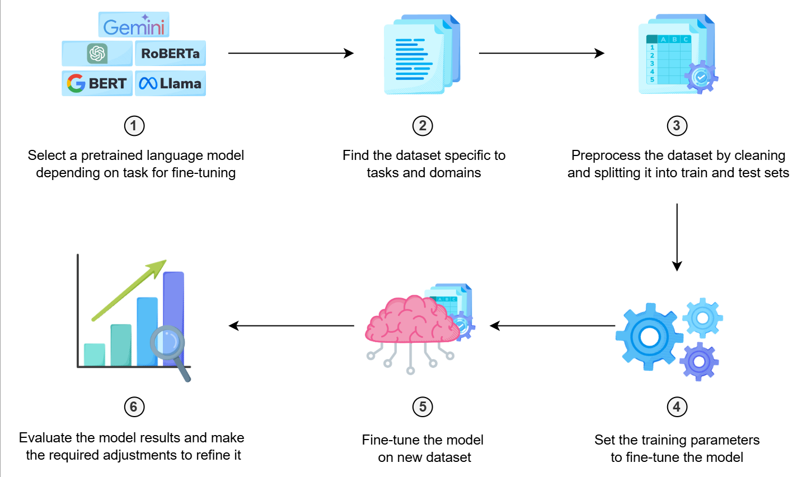

## Pretraining LLMs under the hood

Transformers have revolutionized the field of NLP. Most of the state-of-the-art language models today, such as GPT, Llama, BERT, etc., are built on the transformer architecture to understand and generate human-like text. Transformers can consist of an encoder-decoder architecture, but many models use only one of these components. The encoder takes an input and generates its representation. The representation is passed to the decoder, which generates an output. This architecture helps the models to learn complex details and patterns of data during pretraining.

While pretraining, the model is actually trained on a large corpus of data. The pretraining process involves the following layers:

- Input embedding layer: It converts the input into the numerical representation called embeddings.

- Positional encoding layer: It adds information about the position of the word to the input embedding and forwards this combined information to the encoder.

- Encoder layers: The encoder, consisting of multiple sublayers, uses the self-attention mechanisms to help the model understand the context and relationship between words of the input. The multi-head attention layer of the encoder computes the attention matrix for the input embedding and passes it to the feedforward layer, which generates the representation of the input. The add & norm component is applied after each sublayer of the encoder, which combines the input of the layer with the output (residual connection) and normalizes the activations to stabilize the process.

- Decoder layers: The decoder is also made of multiple sublayers that generate the output sequence. First, the masked multi-head attention layer computes the attention matrix for the output embedding and passes it to the multi-head attention layer. The multi-head attention layer combines it with the encoder’s representation and generates the representation of the output. The add & norm component is applied after each sublayer of the decoder, which combines the input of the layer with the output (residual connection) and normalizes the activations to stabilize the process.

- Linear layer: The linear layer converts the decoder's output to the logits of the size of the vocabulary.

- Softmax layer: The softmax layer applies the softmax function to convert the logits into probabilities. A token with maximum probability is then selected as the final output.

> **Educative Bytes**: A transformer can have up to n number of encoder and decoder layers and the representation obtained by the last layer will be the final output.

During pre-training, all these layers are trained together. **The model understands the general patterns and structures in the early layers and then moves to learn specific data features in the later layer.** This base concept is then used for fine-tuning, where we train the custom model for specific tasks.

## How fine-tuning works

Fine-tuning involves taking a pretrained model that has learned general patterns from large datasets and adjusting its parameters to fit custom, task-specific datasets.

According to our task, we take a dataset smaller than the pretraining data and adjust the model weights to allow it to adapt to the new data. This way, the model refines its existing knowledge and learns the details of the new data. By building on the pretrained model’s knowledge, fine-tuning enables the model to learn more efficiently and accurately.

Let’s consider a scenario to understand the importance of fine-tuning.

### Scenario: Healthcare service 

Consider a renowned healthcare service provider looking to integrate AI models like ChatGPT, Gemini, and Llama in their medical system. They aim to develop a chatbot that creates personalized treatment plans for each patient based on their disease, medical history, genetic profile, and lifestyle. How can they achieve this?

We might think this can be done by simply choosing an LLM for the chatbot and providing patient data as a context to the model. That’s actually right. This approach works well with fewer patients, but as the number of patients increases (say to millions), the size of patient data also increases significantly to GBs and TBs.

Relying on the model’s general knowledge will not suffice because it will now take much longer to look at the context for every query. This also affects the model’s efficiency and accuracy. Most importantly, it will become significantly challenging and time-consuming for healthcare service providers to update context and analyze complex data for effective treatment plans. What to do now?

To deal with this challenging situation, they need a more efficient way to tune their language model to their specific patient’s dataset. They require training the model to learn from their unique dataset and reduce the time spent to update context and analyze complex data. However, training a model from scratch is not feasible, as it requires substantial resources and time. Moreover, this approach risks losing the model’s pre-existing knowledge and abilities while learning from a new dataset. They need a way to refine and tune the existing model to effectively handle and use their vast dataset. That is where fine-tuning comes to help.

Fine-tuning is important because it allows models to:

- Performance: Fine-tuning on specific data, improving performance on specific tasks

- Accuracy: Capture details of the task-specific data, improving the accuracy of the model’s response.

- Efficiency: Reduce overall resources and time by fastening the training process on task-specific data.

- Adaptability: Quickly learn from new data, adapting to user and task requirements.

- Scalability: Fine-tuning allows the model to handle a large volume of personalized interactions efficiently, providing a better user experience.

- Knowledge retention: Retain pretrained knowledge while learning new task-specific information, avoiding “catastrophic forgetting.”

## Training parameters

Configuring the training parameters is important while fine-tuning the model. These parameters play a significant role in controlling how the model learns from our custom dataset and achieves optimal performance while fine-tuning. The following are some parameters that need to be considered for effectively fine-tuning a model:

- Batch size: It is the number of examples processed in one cycle of the training process. The selection of batch size depends on factors such as the size of training data, memory resources, and the complexity of the task. A larger batch size trains more data in one cycle, speeding up the overall training process, but on the other hand, it also requires more memory to process the data.

- Epochs: It is the number of cycles passing through the complete dataset. Selecting the epoch value also depends on the complexity and size of the training data. Lower value of epochs can result into underfitting while the higher value can result in the overfitting of the model.

- Iteration: It is the number of batches required to complete one epoch. Iterations can be calculated by dividing the total number of examples in training data by the batch size.

`Iterations = Total number of examples / Batch size`

 
- Learning rate: This is used to determine how quickly the model learns from training data. A lower learning rate requires more epochs to reflect the effects, while a higher learning rate will reflect changes faster, even with less epochs.

> **Educative Bytes:** Number of batches and the batch size are two different concepts. The number of batches refers to the count of smaller parts into which the dataset is divided, while the batch size refers to the number of examples processed in one batch during the training.

## Steps for fine-tuning
Following are the key steps that we need to perform to fine-tune any LLM:

- Select the model: The first and most important step is to select a pretrained language model depending on our task for fine-tuning. Pretrained models are general-purpose models trained on a large corpus of data. There are a number of open-source (Llama, BERT, and Mistral, etc.) and closed-source (ChatGPT, Gemini, etc.) models available for fine-tuning. We just need to find the model that best fits our resources and requirements.

> Note: In this course, we'll using Meta's Llama 3.1 with 8 billion parameters for fine-tuning. Do note that the choice of model depends on factors like task complexity and available computational resources.

- Prepare the dataset: Our next step is to find a dataset specific to our tasks and domains. This step is very crucial as the entire fine-tuning depends on the dataset we select. It should be structured and arranged so the model can learn from it.

- Preprocess the dataset: After preparing the dataset, we need to perform preprocessing on it. This step involves cleaning and then splitting the data into train and test sets. Once the preprocessing is done, our dataset is ready for fine-tuning.

- Configure the training parameters: The next important step is to configure the parameters for fine-tuning the model. This involves setting training parameters such as learning rate, batch size, epochs, etc.

- Fine-tune the model: Now we are all set for fine-tuning the model. The fine-tuning step trains the model on a new dataset while retaining the previous knowledge model from pretraining. This makes the model learn knowledge about our task-specific data.

- Evaluate and refine: The last step is to evaluate the model results to assess its performance according to our task and make any necessary adjustments. After evaluation, our model is ready to be used for the required task.

