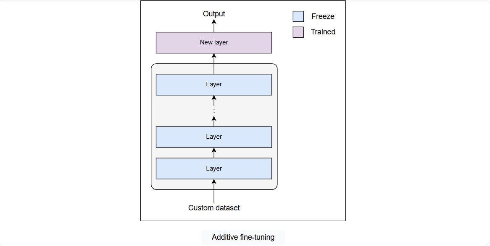

# Types of Fine-Tuning
Learn about the different types of fine-tuning for an LLM.

Fine-tuning is a powerful technique for adapting pretrained language models to specific tasks and datasets, unlocking their full potential for optimal performance. Different fine-tuning techniques have emerged as the field of natural language processing continues to evolve. Each of them has its own strengths, limitations, and use cases.

The choice of fine-tuning technique significantly affects model performance. The complete distribution of fine-tuning techniques is given below:

## Non-parametric fine-tuning 
Non-parametric fine-tuning is the type that works by passing the task-specific data as a context without training any parameters of the model. The model uses the provided contextual information to enhance the model’s accuracy and efficiency on new tasks. This is the cost-effective way of customizing the model with minimal effort and resources.

Following are the ways to perform non-parametric fine-tuning:

### In-context learning
In-context learning is an approach to optimize the model response by providing specific task examples as input. It works by providing the task description and relevant examples as a context in the prompt, guiding the model to generate responses that better fit the user’s preferences.

This is the simplest approach to fine-tuning the model without requiring any technical knowledge, but it also has some limitations. Every model has a context window. Providing a large number of examples in the prompt can take up the context window, leaving less space for additional information (like instructions, context, or any other information, etc.) and resulting in information loss.

### Retrieval-augmented generation (RAG)
Retrieval-augmented generation (RAG) is an AI framework that uses an external knowledge base with a pretrained model to tailor the model for specific tasks. It works by providing task-specific data as external memory to the model. The model searches the knowledge base on each query to find the relevant information and generates a response according to the user preferences. In non-parametric fine-tuning techniques, RAG is one of the most efficient methods for customizing a model without changing its parameters.

RAG works very well up to a certain limit of data. As the knowledge base grows in size, the query time of the model starts to increase, as the model has to search the knowledge base for each query. Large external memory can also lead to information overload, causing misinterpretations and inaccuracies that can compromise the overall efficiency and accuracy of the model.

---

## Parametric fine-tuning
Parametric fine-tuning is the type that works by fine-tuning the model’s parameters on task-specific datasets. It can be the training of all the parameters of the model or training only a few parameters by freezing the rest of the parameters of the model.

Parametric fine-tuning is further categorized into the following:

- Full fine-tuning

- Parametric efficient fine-tuning (PEFT)

Let’s go into the details of each of the following and explore how they differ:

### Full fine-tuning
Full fine-tuning is a technique that involves training all the parameters of all the layers of the model. The model gradually forgets the knowledge from pretraining and learns new knowledge from the task-specific dataset. This is similar to training the model from scratch hence, it requires large computational resources.

Full fine-tuning has two significant drawbacks: the high computational costs required to train all the parameters and catastrophic forgetting, which causes the model to lose the general knowledge and patterns acquired during pretraining and reduces its overall efficiency.

Full fine-tuning is required when the custom dataset is large and significantly different from the pretraining data, making it necessary to train the model from scratch. For example, fine-tuning a model pretrained on a single language on multilingual data or training a model on a specialized domain like medical or legal texts. Otherwise, there are efficient approaches available to fine-tune the model. Let’s explore them one by one.

### Parametric efficient fine-tuning (PEFT)
Parametric efficient fine-tuning (PEFT) is a technique that involves training the selected or newly added parameters to fine-tune the model. This allows the model to adapt to new tasks with minimal changes in the pretrained model. By training the model on fewer parameters, PEFT actually reduces the computational costs and retains the pretrained knowledge, making it an attractive approach for fine-tuning.

PEFT is further categorized into the following:

- Partial fine-tuning

- Adapter modules

- Reparameterized fine-tuning

Let’s begin by exploring partial fine-tuning in detail.

### Partial fine-tuning
A pretrained model learns both general and task-specific details in different layers of the model. Partial fine-tuning, also known as selective fine-tuning, works by freezing the important layers, the layers that have learned general details and patterns of the data, and training only the output layers, which have task-specific details to train the model output on specific tasks. This approach helps the model preserve more of the pretraining knowledge and adapt to task-specific data with minimum training of the model.

There are many methods to implement partial fine-tuning, including BitFit (Bias-terms Fine-tuning), LT-SFT (Lottery Ticket Sparse Fine-Tuning), Diff Pruning, Threshold-Mask, etc.

Let’s look at the details of some of them.

- **BitFit:** The bias-terms Fine-tuning (BitFit) method works by training only a small set of the model’s parameters, specifically the bias-terms, and freezing the rest of the model parameters. The bias-terms have a significant impact on the model’s performance, and updating only them results in accuracy similar to full fine-tuning for small to medium-sized training data.

- **LT-SFT:** The Lottery Ticket Sparse Fine-Tuning (LT-SFT) method involves training only the important weights of the model. It works by first identifying the most important weights obtained by comparing the weights of a fully fine-tuned model on task-specific data with the pretrained model. Then, only fine-tuning the selected top-k weights by creating a binary matrix. LT-SFT requires double effort (full fine-tuning and fine-tuning important weights), but it results in increased efficiency as it only updates the important weights.

Partial fine-tuning saves a lot of computational resources because it only needs to train selected parameters, making it both time and resource-efficient. However, it may not always achieve the same level of task-specific performance as full fine-tuning, especially for complex tasks that require significant adaptations to the model. Additionally, it also risks overfitting to the new task, as updating only selected parameters can lead to learning more about specialized instead of generalized features. Though partial fine-tuning overcomes the issue of catastrophic forgetting by updating selected parameters, there is still a loss of some pretrained knowledge.

To address this limitation, a more advanced PEFT technique, additive fine-tuning, is used. Let’s dive into the details and see how it works.

### Additive fine-tuning
Additive fine-tuning involves adding new layers or modules, known as adapters, to the model for fine-tuning. It only trains the newly added trainable parameters without changing the parameters of the pretrained model.

Many methods help us implement additive fine-tuning, including prompt tuning, Prefix Tuning, P-tuning, LST (Ladder Side-Tuning), MPT (Multitask prompt tuning), and PASTA (Parameter-efficient tuning with Special Token Adaptation). Let’s explore a few of them in detail.

- Prompt-tuning: It involves adding the trainable tokens (called prompts) to the input text and training these tokens to adapt to new tasks. It works by concatenating the prompts with the input text and training only the prompt parameters while freezing the pretrained model.

- Prefix-tuning: This involves prepending soft prompts to the hidden states of the multi-head attention layer and fine-tuning them to adapt to new tasks. It works by using a Feed-Forward Network (FFN) to parameterize the soft prompts and fine-tune the prefix parameters while keeping the pretrained model parameters frozen.

This approach is much faster and more efficient for fine-tuning because it focuses on training only the new layer and preserves the complete pretraining knowledge of the model. This makes the approach resource-efficient. However, on the downside, introducing new layers or modules to the model increases its size and complexity. Additionally, there is a potential risk of overfitting because the newly added layers may become too specialized for task-specific data, reducing generalization on other tasks. To address these challenges, reparameterized fine-tuning comes into action. Let’s explore how it works in detail.

### Reparametrized fine-tuning

The reparameterized fine-tuning technique involves adding or modifying layers of the pretrained model to reduce the number of trainable parameters. It works by reparameterizing the model weights to approximate the original weights while preserving important information. Only reparameterized weights are then trained while freezing the pretrained weights to fine-tune the model.

Many methods can be used to implement reparameterized fine-tuning, including LoRA (Low-Rank Adaptation), QLoRA (Quantized LoRA), KronA (Kronecker Adapter), DyLoRA (Dynamic LoRA), AdaLoRA (Adaptive LoRA), etc. Let’s look at the details of some of them.

- **LoRA:** The Low-Rank Adaptation (LoRA) uses a low-rank transformation technique to reduce the trainable parameters of the pretrained model while preserving important information. This method reparameterizes the original weights (parameters) using two low-rank matrices. The low-rank matrices are then trained, freezing the pretrained weights to fine-tune the model on a new task.

- **KronA:** The Kronecker Adapter (KronA) works similarly to LoRA, but instead of using low-rank transformation, it uses Kronecker product decomposition to reduce the trainable parameters. The decomposed matrices are trained while freezing the pretrained weights to fine-tune the model on new tasks.

This approach allows the model to efficiently adapt to new tasks without compromising its pretrained knowledge. Like all other techniques, reparameterized fine-tuning has some limitations. It can face challenges such as limited adaptation or underfitting, especially when dealing with complex datasets.

### Comparing the types of fine-tuning
Let’s take a brief overview of all the fine-tuning techniques with the following summarization table:

### Choosing the right fine-tuning technique
We have explored multiple fine-tuning techniques, each with its strengths, limitations, and specific use cases. Selecting the appropriate method is crucial while fine-tuning the model to achieve the desired performance.

The following are some key factors to consider when choosing a fine-tuning technique:

- Model size

- Task complexity

- Computational resources

- Deployment needs

- Preservation of pretrained knowledge

In this course, we will explore fine-tuning LLM using LoRA:

LoRA is nowadays the most widely used technique for fine-tuning due to its balance of efficiency, adaptability, and preservation of pretrained knowledge. It allows us to fine-tune the model on tasks without the need for extensive computational resources, making it a choice for a wide range of applications, from domain-specific tasks to large-scale deployments.