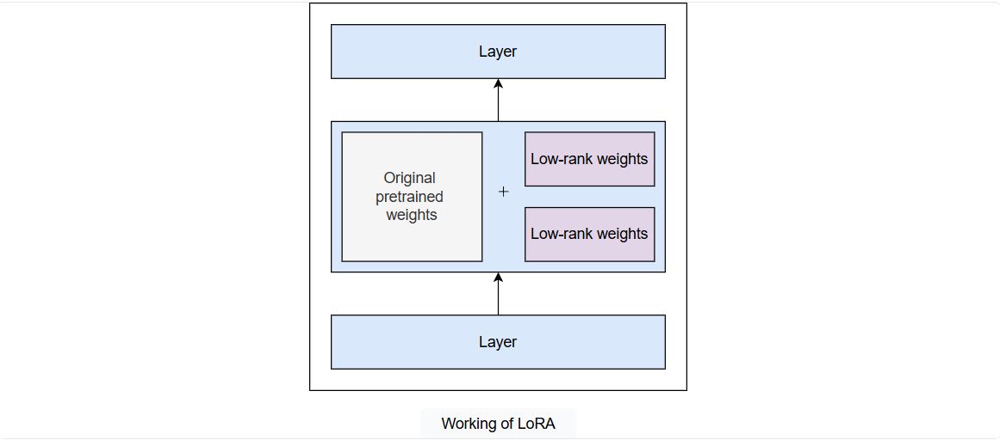
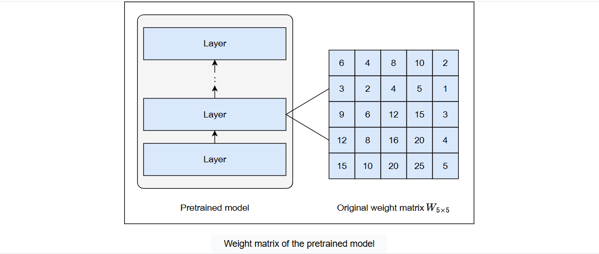
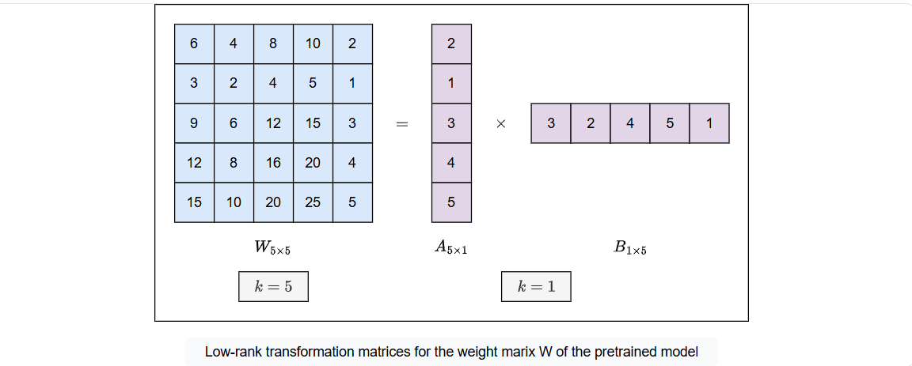
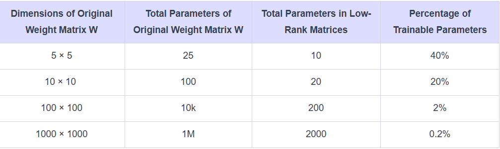
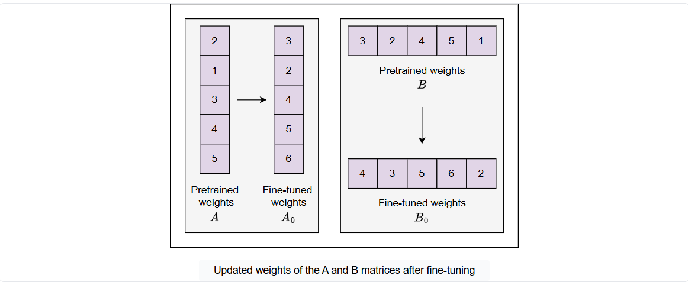
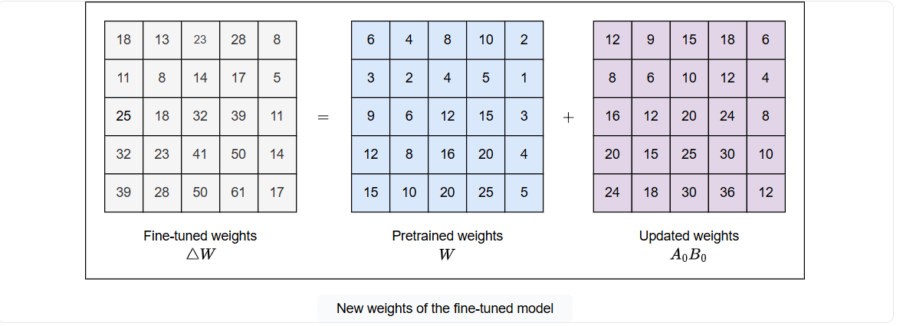

# LoRa (Low-Rank Adaptation)

With rapid development in the field of generative AI, LLMs are becoming an integral part of everyone’s daily life and business operations. They are transforming the way we interact, work, and innovate. Besides their impressive capabilities, these models often require to be trained for specific tasks, datasets, or domains to achieve optimal performance. Fine-tuning helps us train the model on specific tasks and datasets, unlocking their full potential, but it’s a computationally expensive and time-consuming task to perform. As we push the boundaries of AI, there comes a need to develop efficient and cost-effective techniques for fine-tuning, which maximize the model’s performance.

In 2023, Hugging Face officially released parameter-efficient fine-tuning (PEFT), an approach that trains the model with a small number of parameters without compromising its performance. PEFT is implemented by various techniques, one of which is Low-Rank Adaptation (LoRA), which is an effective way to fine-tune LLMs, balancing efficiency and adaptability. Let’s dive into the details of LoRA and see how it works.

## What is LoRA?

LoRA is a technique that works by adding reparameterized weights to a pretrained model without modifying the original weights. It uses a low-rank transformation technique that reparameterizes the model’s weights using two low-rank matrices. Only these low-rank matrices are trained to adapt the model to a new task, efficiently reducing the number of trainable parameters. This approach significantly decreases computational expenses and training time, making LoRA an attractive solution for efficient fine-tuning.

## How does LoRA work?

LoRA works by decomposing the weight matrices of the pretrained model into smaller, lower-rank matrices that approximate the larger ones. These new matrices are injected into each layer of the transformer and trained to adapt to the dataset. The original weights of the pretrained model are frozen to avoid catastrophic forgetting. Updated weights are then combined with the original ones to produce the results.

Let’s understand this by taking an example. Consider a weight matrix 
$W$ with dimensions $[m \times n]$ of a random layer of a pretrained model.

> Note: Original weight matrices are very large in size. We take a small weight matrix with some random values for the understanding of the concept.

LoRA adds new weights to the transformer layer obtained by decomposing the original weight matrix $W$ into two low-rank matrices, say $A$ with dimensions $[m \times k]$ and $B$ with dimensions $[k \times n]$, that approximate it. Here $k$ is the **rank** of new matrices. This technique is called **low-rank transformation**.

We can see that the weight matrix W with dimensions $[5 \times 5]$ has a total of 25 values in it. On the other hand, if we count the values of low-rank matrices, they are only 10 (5 + 5), which is 40% less than the original matrix values.

We can see this difference more clearly if our weight matrix grows to larger values, say a $[10 \times 10]$ matrix with 100 values. The count of values in low-rank matrices (with rank 1) is only 20 (10 + 10), which is only 20% of the original values. This difference continues to increase with increasing values of the matrix, as we can see in the table below:

The low-rank transformation technique drastically reduces the size of the trainable parameters. Now, while fine-tuning the model, only $A, B$ matrices with reduced parameters are trained, reducing GPU consumption to around three times. After fine-tuning, the weights of the matrix $A, B$ will be updated, represented by the $A_{0}, B_{0}$, respectively.

After fine-tuning, the updated weights are combined with the original weights for the complete LoRA fine-tuned model.

$$\Delta W = W + A_{0}B_{0} $$

where:
- $\Delta W$ are the new weights of the fine-tuned model.
- $W$ are the weights of the original pretrained model.
- $A_{0}$ and $B_{0}$ are the fine-tuned weights of the low-rank matrices.

The illustration below calculates the new weights of the fine-tuned models.

## Parameters of LoRA#
Some important parameters that are necessary for implementing LoRA include:

- Rank

- Alpha

- Dropout

Let’s explore each of them in detail.

## Rank

In the above example, we discussed low-rank matrices with rank 1 only, but to implement LoRA, we need different rank values to decompose the matrix. How can we find the right rank value for implementing LoRA?

The rank of a matrix defines how much information a matrix can hold. It controls the precision of weights and the number of trainable parameters. Choosing the value of rank depends on the following:

- **Model size**: Choosing the rank of a matrix depends on the number of parameters of the model. If the model size is large, a smaller value of rank will also be enough to capture the information. However, if the model size is small, we need a high value of rank to adapt the model.

- **Task complexity**: If the task is simple, a small value of rank will be enough for the model to adapt to the specific data, as it already possesses a strong general understanding. However, if the task is complex, a higher value of rank will be needed to adapt the model to task complexities.

- **Computational resources**: Choosing the rank of a matrix depends on the availability of computational resources. A higher value of rank will have more trainable parameters, resulting in more training time and computational resources. A low value of rank will have less trainable parameters. It will reduce the computational time and resources.

- **Level of precision**: The desired level of precision of weights is also important when choosing the rank. A higher value of rank will have more precise weights as compared to the low value of rank.

The rank value is crucial for implementing LoRA. A low-rank value (1–8) is considerable for general downstream tasks, such as sentiment analysis, question-answering, etc., which trains the model efficiently without losing any information. A medium rank (16–32) is suitable for most tasks as it balances precision and efficiency with a reasonable number of parameters. A high-rank value (32+) is useful while training the model on complex tasks that are very different from the pretraining data, such as fine-tuning for specialized tasks like medical or legal document analysis, domain-specific tasks, or multilingual tasks, etc., to achieve good precision.

## Alpha

In LoRA, alpha controls the scaling of the fine-tuned weights before they are added to the original weights of the model. The scaling factor is calculated by dividing alpha by the rank of the low-rank matrices. It is then multiplied with the updated weights before merging to control the effect of fine-tuned weights on the model after training. The formula for calculating scaling factor is given by:

$$
Scaling Factor(\gamma_{r}) = \frac{\alpha}{r}
$$

The final formula for calculating the fine-tuned weights will be given by:

$$
\Delta W = W + \gamma_{r}A_{0}B_{0}
$$

Let’s see the effects of alpha on fine-tuning the results of the model.

- **Alpha > rank**: The larger the value of alpha relative to the rank, the greater the impact of fine-tuned weights on the model. This is useful when the fine-tuning dataset is different from the pretraining data, and we need to increase the effect of fine-tuning on the model’s output.

- **Alpha < rank**: The lower the value of alpha relative to the rank, the less the influence of the fine-tuned weights on the model. This will incline the model more toward the pretrained weights.

- **Alpha = rank**: An ideal case is to keep the alpha equal to the rank if our fine-tuning dataset is simple. This balances the influence of pretrained and fine-tuned weights on the trained model by applying a scaling factor of 1.

## Dropout

Dropout is a regularization technique that prevents overfitting of the model by turning off some parameters of the model during training. It randomly sets some part of trainable parameters to 0, allowing the model to generalize better on the training dataset.

- **High dropout**: A high dropout value (say 0.1, which is 10%) means more parameters of the low-rank matrices will be dropped off during each batch of the training. We have to be careful as setting the dropout value too high can also lead to underfitting, where the model doesn’t learn enough from the training data.

- **Low dropout**: A low dropout value (say 0.05, which is 0.5%) means fewer parameters of the low-rank matrices will be dropped off during each batch of the training.

> **Educative Bytes**: According to QLoRA paper, high dropout value is suitable for smaller models (upto 13B parameters) and low dropout value is suitable for large models (33B or 65B parameters).

When implementing LoRA, it is important to note that the low-rank approximation is not fixed across different tasks. We need to experiment and play with configurations to find optimal values that achieve the desired results.