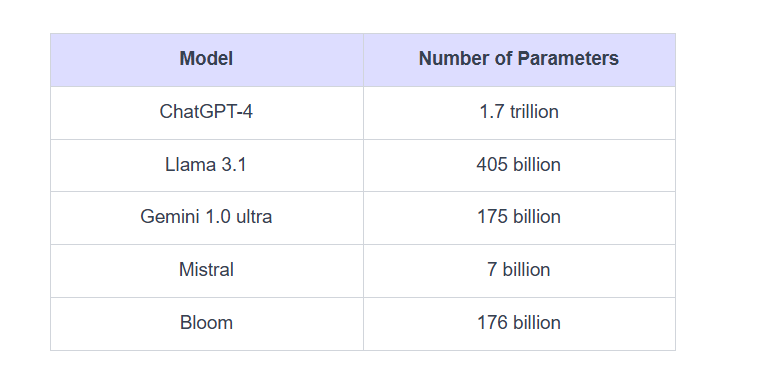
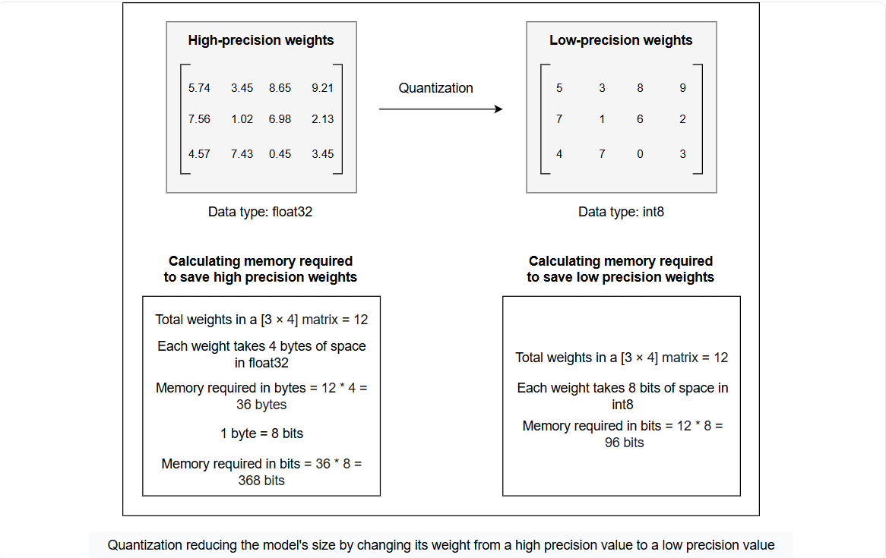
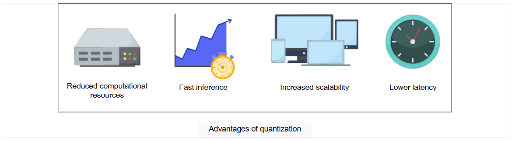

# Quantization: Reducing the Model Size

Learn about the quantization techniques and understand how they reduce the size of the model.

Generative AI has been revolutionized in recent years, with LLMs evolving rapidly to become more powerful than ever before. These models can now understand and respond to user queries in a human-like manner. They are capable of performing complex tasks like question-answering, text generation, sentiment analysis, code generation, image generation, and much more. With all this intelligence and advancements, these models are also getting bigger and more complex in terms of the number of parameters. For example, given below are the number of parameters of some widely used large language models:

This growing complexity brings challenges, such as the memory required to train and deploy these large-scale models. As models expand, the demand for computational resources also increases, making it difficult to manage and deploy them efficiently. This raises a crucial question: how can we fine-tune large-scale models like GPT and Llama on task-specific data then?

This is where quantization comes into play, offering a solution to these challenges. Let’s get into the details of the quantization process and how it facilitates fine-tuning.

# Quantization

Quantization is a technique for reducing the model size by compressing the model weights from a high-precision value to a low-precision value. The weights of a language model are the vectors that can be represented in different data types based on the availability of computational resources and required precision. The default data type of most of the models is a 32-bit floating number (float32), which means each weight of such models takes 4 bytes of space in the memory.

Quantization reduces the number of bits required for each weight of the model by changing the data type from a 32-bit floating number (float32), which holds more information, to an 8-bit (int8) or a 4-bit integer (int4), which holds less.

This reduction in the number of bits required to store data significantly reduces the model size and the number of calculations required during inference. This process enables large language models to use less memory and computational resources, making it more efficient to train and deploy without any significant impact on the model’s accuracy and performance.

# Why use quantization?

Quantization is an important technique for fine-tuning and deploying large language models in real-world applications. As the models increase in size and complexity, quantization becomes essential for managing resource consumption without compromising accuracy. The following are some key benefits of using quantization:

- **Reduced resource consumption**: Quantization reduces the resource consumption of large language models by compressing the model weights from high precision to low precision. This process minimizes the memory and computational requirements, making it possible to deploy models on resource-constrained devices such as smartphones, smartwatches, medical devices, etc.

- **Fast inference**: Quantization increases the training and inference speed of the model due to less computation and memory required for low-precision weights. This increased speed is beneficial when deploying models in real-time applications.

- **Increased scalability**: Quantization allows the large-size model to be more scalable without increasing resource requirements. This enables the deployment of the model on various platforms, including hardware-constrained devices.

- **Lower latency**: Quantization helps reduce latency in real-time applications. Since the model processes information more quickly using low-precision operations, it’s perfect for situations where speed is crucial, like in self-driving cars or language translation.

# Types of quantization

Quantization can be applied at various stages during the model training process. There are many types of quantization, and the two main types include:

## Post-training quantization (PTQ)

As the name suggests, post-training quantization (PTQ) is the quantization of LLM after it has been trained. It involves quantizing the model parameters during the inference phase after training the model. Post-training quantization is fast and easy to implement; however, it results in less model accuracy and performance due to less precise values of the weight.

Post-training quantization is best for scenarios where quick deployment and resource efficiency are required. Some real-world applications of PTQ include:

- **Edgy devices**: Deploying AI models on edgy devices with limited memory and computing resources, such as smartphones, smart home devices, etc.

- **IoT**: Optimizing AI models for IoT devices, such as smart sensors, cameras, etc.

- **Embedded systems**: Reducing memory and increasing performance in embedded systems, such as medical devices.

## Quantization-aware training (QAT)

Quantization-aware training (QAT) involves quantizing the model during training. This method works by changing the weights during the training, which results in the model with better accuracy and performance; however, it requires more computational resources as compared to PTQ.

Quantization-aware training is suitable for applications where optimization and accuracy are important. The following are some real-world applications of QAT:

- **Computer vision**: Training models for computer vision tasks such as image classification, object detection, and segmentation tasks.

- **Natural language processing**: Building compact language models for NLP tasks such as text classification, language translation, etc.

- **Autonomous vehicles**: Improving AI models for efficiency, accuracy, and reliability in autonomous vehicles.

# Techniques for model quantization
Several techniques exist to quantize the model to reduce its size. These include:

- **GGML (Group-wise Gradient-based Mix-Bit Low-rank)**: This is a C-based machine learning library specially designed for the quantization of Llama models. It uses the k-quants system to assign different bit widths to different weights based on their gradient magnitudes, reducing memory and computational costs while preserving model performance. It is specifically developed for quantizing models to allow them to be executed on a broader range of hardware, especially CPUs.

- **GGUF (GPT-Generated Unified Format)**: This is the successor to GGML and addresses its limitation of only quantizing Llama models by offering support for a broader range of models.

- **GPTQ (Post-Training Quantization for Generative Pre-Trained Transformers)**: This is a layerwise quantization technique where the weights of each layer are quantized independently by converting the floating point values to 2, 3, 4, and 8-bit integers, minimizing the mean square error (MSE), i.e., the squared error between the outputs of the high-precision layer and the quantized layer. GPTQ supports 2 to 8-bit integer conversion with commonly used 4-bit precision of weights. It can be implemented by the AutoGPTQ library provided by the Hugging Face transformers library.

- **Bitsandbytes**: adjusts the model’s weights by converting them to 4-bit precision using NF4 (4-bit Normal Float) format. During inference, these weights are dequantized back to higher precision (typically 16-bit) for computation. This process enhances the model performance, balancing efficiency and memory. It can be implemented by the bitsandbytes library provided by the Hugging Face transformers library.

> **Educative Bytes**: GGML, GGUF, and GPTQ techniques uses the post training quantization (PTQ) which quantize the model after training, whereas the bitsandbytes technique uses the quantization aware training (QAT) which quantize the model during training, allowing it to adapt to the reduced precision.

Quantization is a powerful technique for optimizing large language models, reducing their memory size and computational requirements while preserving their performance. This enables the training and deployment of these models on resource-constrained devices, making AI more accessible and widespread.