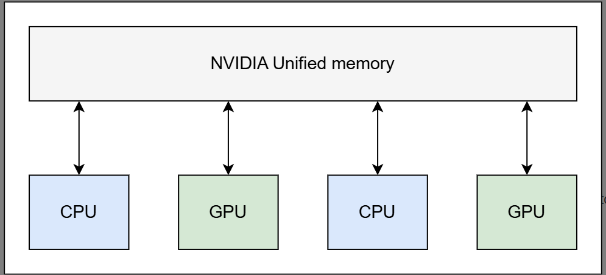
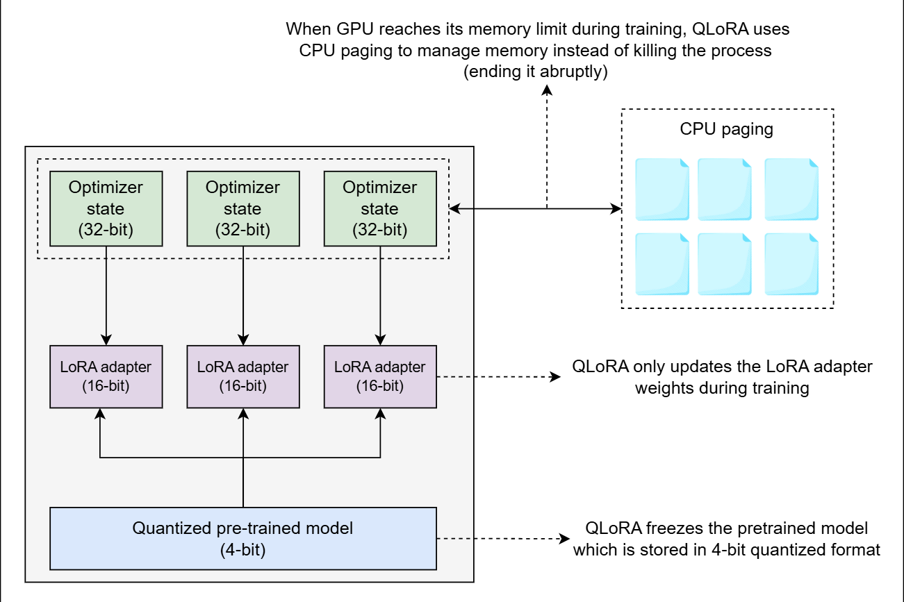

# Quantized Low-Rank Adaptation (QLoRA)

Learn about the components and working of the Quantized Low-Rank Adaptation (QLoRA) technique.

Quantized Low-Rank Adaptation (QLoRA), as the name suggests, combines the two most widely used methods of fine-tuning, i.e., LoRA and quantization. Where LoRA uses the low-rank matrices to reduce the number of trainable parameters, QLoRA extends it by further reducing the model size by quantizing its weights.

# Components of QLoRA

The following are the three main components of QLoRA:

- 4-bit NormalFloat quantization

- Double quantization

- Paged optimizers

Let’s dive into the details of each component

# 4-bit NormalFloat quantization
The NormalFloat (NF) data type is a theoretically optimal data type that uses quantile quantization to ensure that each quantization bin has an equal number of values assigned from the input tensor.

QLoRA uses a special type of quantization called 4-bit NormalFloat (NF4) quantization, which compresses the model’s weights from a 32-bit floating point to a 4-bit format. Model weights, which tend to follow a normal distribution (most values are near zero), are first scaled to fit within the range of [−1,1], and then compressed to 4-bit.

This technique balances precision and efficiency by reducing the model’s parameter precision to 4 bits while retaining enough information to perform tasks with minimal loss in accuracy. This significantly reduces the model’s memory footprint.

# Double quantization
QLoRA introduces double quantization, which is the process of quantizing the quantization constants to further reduce the memory footprints. During quantization, when we convert a high-precision (more bits) data type to a low-precision (fewer bits) data type, the source data type is rescaled to the target data type range through normalization by the absolute maximum of the input tensor, which is called the quantization constant. This is done to ensure that the quantization process uses the entire range of the target data type.

Example: FP32 to int8 quantization
To understand this, consider we are quantizing a 32-bit floating point (FP32) tensor to an int8 tensor with a range [−127,127]. The FP32 tensor,
$X^{FP32}$, needs to be scaled to the range [−127,127]
, through normalization by the absolute maximum of the FP32 tensor. The formula is given by:

$$X^{int8} = round(\frac{127}{absmax(X^{FP32})}*X^{FP32})$$

which equals to:

$$X^{int8} = round(c^{FP32}*X^{FP32})$$

Where $c$ is the quantization constant. We need to store this quantization constant to perform dequantization for calculations. Dequantization is inverse.

$$X^{FP32} = \frac{X^{int8}}{c^{FP32}}$$

> **Educative Bytes**: During the quantization process, some information is irretrievably lost due to rounding, which cannot be recovered during dequantization.

There is a problem with this approach. If a large magnitude value known as an **outlier**, which tends to hold the important information in the model, appears in the input tensor, it can cause the quantization bins (a specific range of values that are mapped to a single representative value) to be used inefficiently, i.e., some bins are populated with few or no numbers. It leads to the waste of computational resources. To address this, block-wise quantization is used.

Practical example:

#### **Supponiamo di avere un tensore FP32 con massimo valore assoluto 256:**
- \( X^{FP32} = 128.5 \)
- \( \text{absmax}(X^{FP32}) = 256 \)
- Calcoliamo la costante di quantizzazione:

  \[
  c^{FP32} = \frac{127}{256} \approx 0.496
  \]

- Applichiamo la quantizzazione:

  \[
  X^{int8} = \text{round} ( 0.496 \times 128.5 ) = \text{round}(63.7) = 64
  \]

#### **Per recuperare il valore FP32 originale:**
\[
X^{FP32} = \frac{X^{int8}}{c^{FP32}} = \frac{64}{0.496} \approx 129.0
\]

# Block-wise quantization

The block-wise quantization splits the input tensor into blocks that are quantized independently to prevent the outlier issue. Each block has its own quantization constant. Now, instead of one quantization constant, we need to save quantization constants for all the blocks, which requires additional memory.

Double quantization quantizes these quantization constants to reduce the extra memory required to store them, eventually reducing the model’s memory footprint.

# Paged optimizers

QLoRA uses another technique called paged optimizers to avoid memory spikes. Paged optimizers use the NVIDIA unified memory to transfer data between CPU and GPU during processing to avoid the GPU run-out of memory errors.

# Working of QLoRA

QLoRA works by applying quantization to the model weights and storing them in a compact, 4-bit NormalFloat (NF4) data type to save memory and then dequantize these weights into a higher-precision BrainFloat16 (bfloat16) data type for computations. The process involves double dequantization, where both the model’s quantized weights and quantization constants are dequantized before use. During fine-tuning, only the LoRA adapter weights are updated, while the base model’s 4-bit weights remain fixed. Given below is the high-level architecture of QLoRA:

QLoRA is particularly suited for memory-critical applications, providing a balance between memory efficiency and precision. This enables fine-tuning of LLMs on a single GPU, facilitating deployment on resource-constrained devices, such as consumer GPUs or smaller infrastructures, while maintaining satisfactory performance.